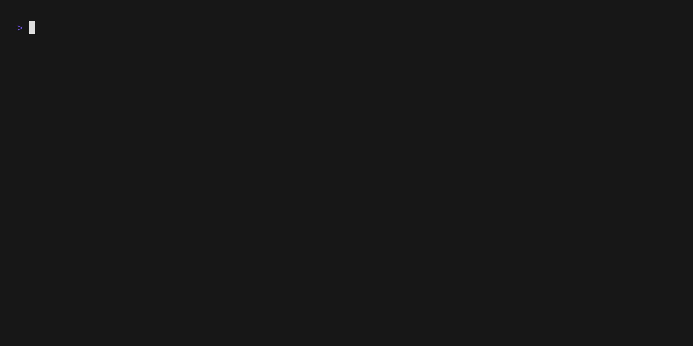

# archive-triage
A Go tool to sort and file links with

Controls:
| key | description                                                       |
| --- | ----------------------------------------------------------------- |
| i   | ingest a link file; up/down and enter to choose a file and format |
| e   | export links into a file                                          |
| s   | mark link as saved; input tags then press escape                  |
| d   | dismiss link                                                      |
| u   | undo last action                                                  |
| p   | postpone link                                                     |
| r   | reset postponed links                                             |
| o   | open current link                                                 |
| c   | copy current link to clipboard                                    |
| w   | go back to the welcome screen                                     |
| q   | quit                                                              |

